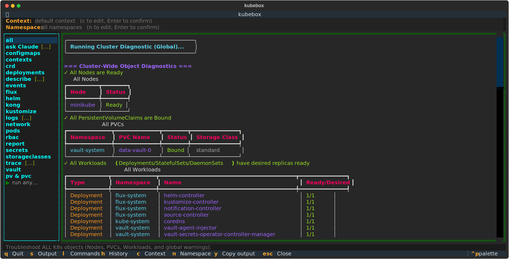
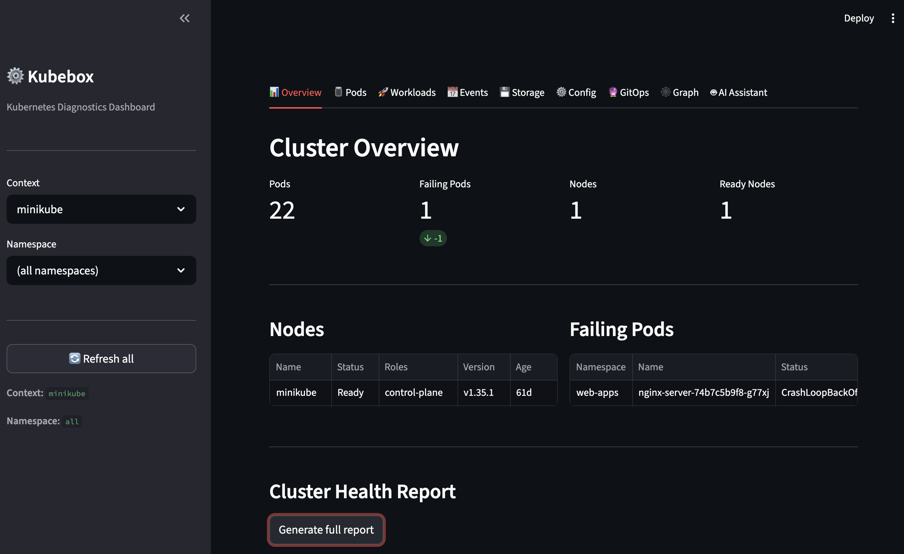
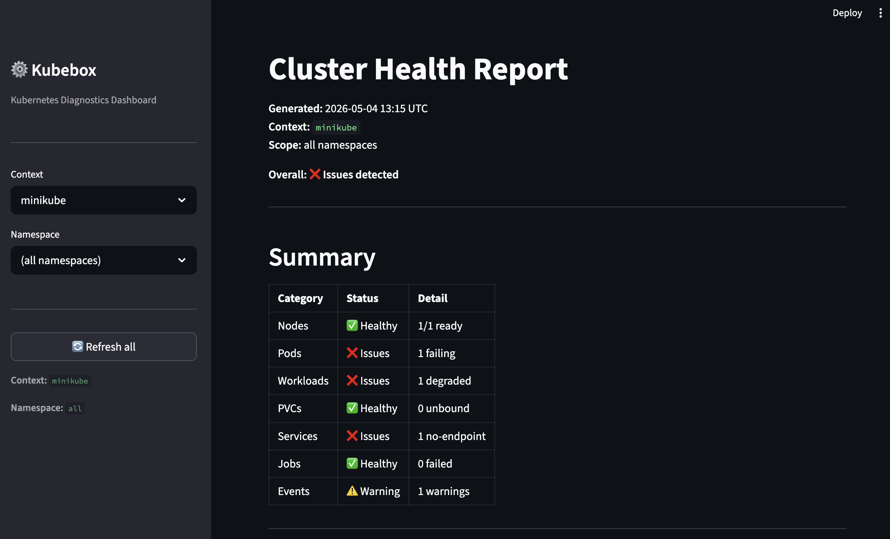
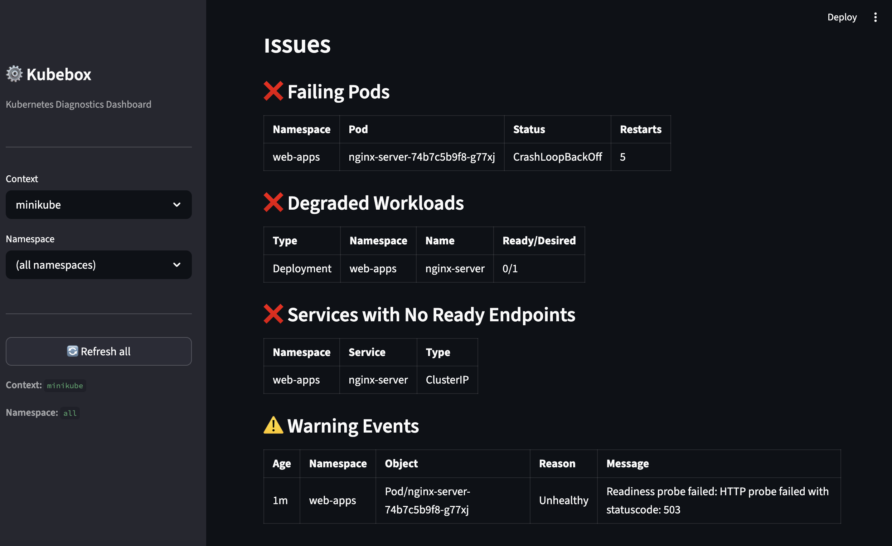
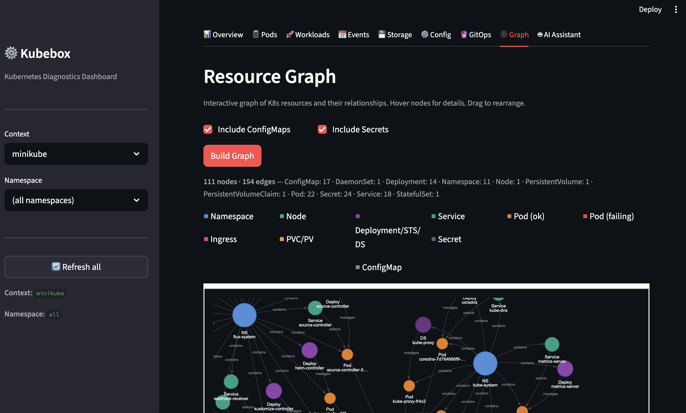
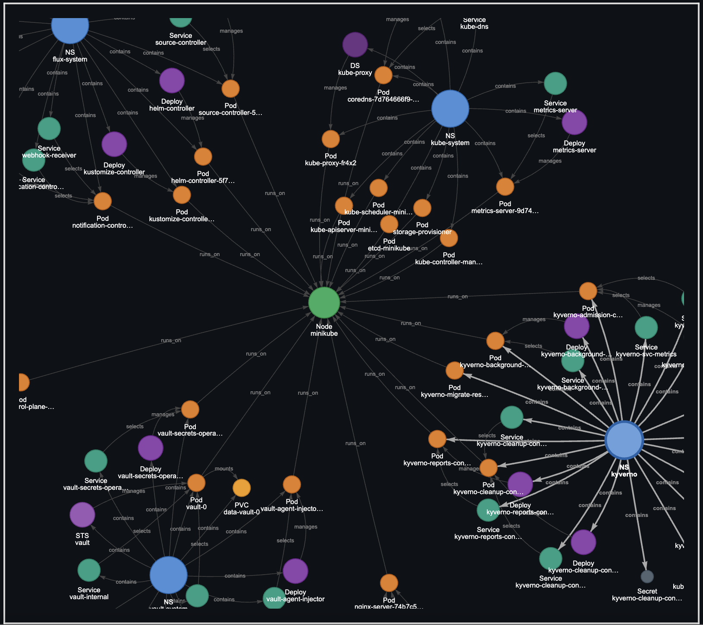
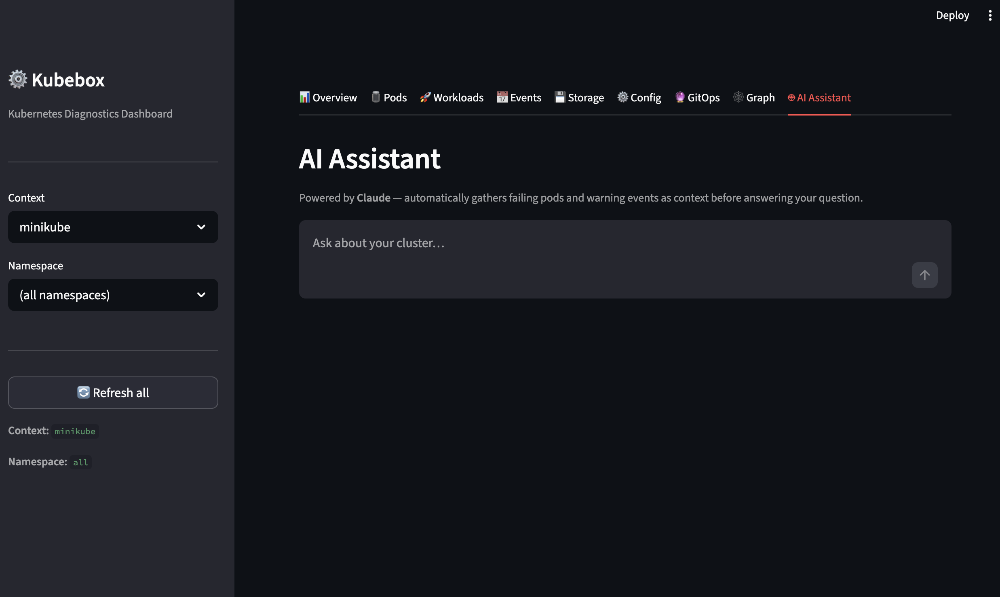

# kubebox

A standalone, read-only Python toolbox designed to act as an AI-powered DevOps/SRE assistant for troubleshooting Kubernetes clusters. Available as a **CLI**, a **terminal UI dashboard**, and a **Streamlit web dashboard**. It automatically gathers diagnostics, analyzes states, and highlights failures across Kubernetes, FluxCD, Kong, Helm, and HashiCorp Vault — and can stream AI root-cause analysis via Claude — without making any modifications to the cluster.

> **Smart auto-execution:** When a diagnostic tip suggests a `kubectl describe` or `kubectl logs` command, the tool runs it automatically and prints the output inline — no copy-pasting required.

> **Full object listings:** Every command shows a complete table of all scanned objects (healthy and unhealthy) after its diagnostic summary, so you always have the full picture.

> **Event-driven suggestions:** The `all` command analyzes warning events and automatically emits targeted command suggestions (with auto-execution for `describe` and `logs`) for each actionable issue found.

## Screenshots



## Prerequisites

- Python 3.12+
- [uv](https://github.com/astral-sh/uv) (for dependency management)
- `kubectl` configured and authenticated against your target cluster
- `helm` CLI (if you intend to use the Helm diagnostics)
- `ANTHROPIC_API_KEY` environment variable (for the `ask` command and `logs --analyze`)

## Global flags

Every command supports these flags:

| Flag          | Short | Description                                                                                                                      |
| ------------- | ----- | -------------------------------------------------------------------------------------------------------------------------------- |
| `--context`   | `-c`  | Target a specific kubeconfig context (e.g. `staging`, `production`). Injected automatically into all `kubectl` and `helm` calls. |
| `--namespace` | `-n`  | Filter results to a specific namespace (where applicable).                                                                       |

`pods`, `deployments`, `events`, and `metrics` additionally support:

| Flag         | Short | Description                                                                                                              |
| ------------ | ----- | ------------------------------------------------------------------------------------------------------------------------ |
| `--watch`    | `-w`  | Continuously re-run the diagnostic and refresh the screen.                                                               |
| `--interval` | `-i`  | Polling interval in seconds when `--watch` is active (default: `5` for pods/deployments, `10` for events, `15` for metrics). |
| `--output`   | `-o`  | Return raw structured output: `json` or `yaml`. Bypasses Rich display for scripting.                                    |

`helm` and `crd` also support `--output / -o`.

## Installation

1. Clone or navigate to the repository directory.
2. Sync the virtual environment:

```bash
uv sync
```

## Running

**CLI:**
```bash
uv run main.py --help
```

**Terminal UI dashboard:**
```bash
uv run main.py dashboard
```

**Streamlit web dashboard:**
```bash
uv run streamlit run streamlit_app.py
```

Then open [http://localhost:8501](http://localhost:8501) in your browser.

## Web Dashboard

`streamlit_app.py` provides a browser-based alternative to the TUI. It reads the same kubeconfig and uses the same core diagnostic modules.

**Sidebar** — context selector (all kubeconfig contexts), namespace selector (live from the cluster), and a one-click cache refresh.

**Tabs:**

| Tab | Contents |
|-----|----------|
| **📊 Overview** | Metrics cards (pods, failing pods, nodes, ready nodes), nodes table, failing pods table, full health report generator |
| **🫙 Pods** | Filterable pod table (failing-only toggle + name search), live log fetcher, `kubectl describe` runner |
| **🚀 Workloads** | Deployments, StatefulSets, DaemonSets, and Services sub-tabs; full workload diagnostic scan |
| **📅 Events** | Filterable by type (Warning/Normal), reason substring, and row limit — warning rows highlighted |
| **💾 Storage** | PVCs (bound/unbound status), PVs, StorageClasses |
| **⚙️ Config** | ConfigMaps, Secrets (names and types only — values never shown) |
| **🔮 GitOps** | Flux CD status, Helm releases, CRD condition check |
| **🕸️ Graph** | Interactive resource graph — nodes colored by kind, edges showing `manages`, `selects`, `routes_to`, `runs_on`, `mounts`, and `bound_to` relationships; optional ConfigMap/Secret inclusion; failing pods highlighted in red |
| **🤖 AI Assistant** | Chat interface — automatically gathers failing pods and recent warning events as context, streams Claude responses |

All K8s data is cached per context+namespace with a 20–60 second TTL. The AI assistant requires `ANTHROPIC_API_KEY`.

### Screenshots

**Cluster Overview**



**Cluster Health Report**





**Resource Graph**





**AI Assistant**



## Building a Standalone Executable

Package the toolbox into a single binary using [PyInstaller](https://pyinstaller.org/):

```bash
# Install PyInstaller (once)
uv add --dev pyinstaller

# Build
uv run --group dev python -m PyInstaller --onefile --name kubebox main.py

# Run or install globally
./dist/kubebox --help
sudo mv ./dist/kubebox /usr/local/bin/kubebox
```

## Commands

Commands are listed in alphabetical order. Use `-h` or `--help` on any command for details.

### `contexts` — List Kubeconfig Contexts

Lists all contexts from your kubeconfig in a table and marks the active one with `✓`. Use the `Name` value with `--context` on any other command.

```bash
kubebox contexts
```

### `all` — Full Cluster Diagnostic

Checks Nodes (NotReady), PVCs (Unbound), Workloads (Deployments, StatefulSets, DaemonSets), Services, Ingresses, Jobs, CronJobs, HPAs, PersistentVolumes, Namespaces, ConfigMaps, and Secrets. Finishes with a cluster-wide Warning events table and up to 5 targeted command suggestions based on event reasons (`BackOff`, `OOMKilling`, `FailedScheduling`, `FailedMount`, `Unhealthy`, `Evicted`, `NodeNotReady`, etc.).

```bash
kubebox all
kubebox all -n my-app-namespace
```

### `ask` — Ask Claude

Gathers live pod failures and Warning events as context, then streams a plain-English root-cause analysis and recommendations from Claude (`claude-opus-4-7`). Automatically fetches the last 50 lines of logs from up to 3 currently failing pods and includes them in the AI context — no need to manually run `kubebox logs` first. Supports `-n` to focus on a specific namespace. Requires `ANTHROPIC_API_KEY`.

```bash
kubebox ask "why is my app crashlooping?" -n prod
kubebox ask "are there any scheduling issues?"
kubebox ask "what's wrong?" --context staging -n payments
```

### `configmaps` — ConfigMap Listing

Lists all ConfigMaps with their key counts. System namespaces (`kube-system`, `kube-public`, `kube-node-lease`) are excluded when no namespace filter is set.

```bash
kubebox configmaps
kubebox configmaps -n my-namespace
```

### `crd` — Custom Resource Definitions

Discovers all CRDs in the cluster, fetches their instances, and surfaces any with unhealthy conditions. All conditions on every instance are inspected — any condition with `status=False` or `status=Unknown` is flagged, regardless of condition type. Shows a summary table grouped by CRD and namespace, then a detailed failing-instances table listing the unhealthy condition names and their statuses.

```bash
kubebox crd
kubebox crd -n my-namespace
kubebox crd -o json | jq '.items[].metadata.name'
```

### `dashboard` — TUI Dashboard

Launches a full-screen terminal UI with a command list on the left and scrollable output on the right. Select a command with the keyboard to run it; commands that require arguments open an inline input bar pre-filled with a usage hint. A **"run any command…"** entry at the bottom of the list opens an empty input bar where any kubebox command (with arguments) can be typed freely — non-kubebox input is rejected with an error.

**Context selector** — a one-line bar at the very top of the dashboard holds the active kubeconfig context. Press `c` to edit it and `Enter` to confirm. The context is automatically injected as `--context <ctx>` into every command run from the dashboard.

**Namespace selector** — a one-line bar below the context bar holds the active namespace. Press `n` to edit it and `Enter` to confirm. The namespace is automatically injected into every command run from the dashboard (as `-n <ns>`), so you never have to type it repeatedly. Both active values are shown in the app subtitle.

**Command history** — press `h` to toggle a history panel below the command list. It shows the last 20 commands with their timestamps. Selecting an entry instantly restores its captured output without re-running the command. Press `r` at any time to re-run whichever command is currently displayed.

**AI remediation panel** — after running `ask Claude`, any `kubectl`/`helm`/`kubebox` commands found in Claude's response appear in a green-bordered panel below the output. Select an entry and press `Enter` to copy it to the clipboard. Press `p` to focus the panel from the keyboard.

**Metrics panel** — press `m` to toggle a live metrics panel above the output area. Shows node CPU and memory utilization (color-coded) and the top 10 pods by CPU for the active namespace. Auto-refreshes every 30 seconds while open; pauses when hidden. Refreshes immediately on context or namespace change. Shows a specific error message when metrics-server is unavailable (404 → not installed, 403 → RBAC, 503 → not yet ready).

**Copy output** — press `y` at any time to copy the current output pane to the clipboard. After running `report` from the dashboard a toast reminds you to press `y` to grab the Markdown.

```bash
kubebox dashboard
```

Keybindings: `s` focus output · `l` focus list · `h` toggle history · `m` toggle metrics · `c` edit context · `n` edit namespace · `y` copy output · `p` focus fixes · `r` re-run · `Esc` cancel/stop stream · `q` quit.

### `deployments` — Deployment Health

Scans all namespaces (or a specific namespace) for degraded deployments. Surfaces any with mismatched Ready/Desired replicas in a failing table with a diagnostic tip, then prints a full listing of every deployment with Ready/Desired, Up-to-date, Available, and Age columns.

```bash
kubebox deployments
kubebox deployments -n my-app-namespace
kubebox deployments --watch --interval 10
kubebox deployments --context production -o json
```

### `describe` — Safe Describe Wrapper

Fetches and syntax-highlights the describe output of any Kubernetes object.

```bash
kubebox describe deployment frontend -n prod
kubebox describe node my-node
```

### `events` — Kubernetes Events Browser

Fetches cluster events and supports filtering by namespace, type (`Warning` / `Normal`), reason, or age. Use `--watch` to continuously poll for new events.

```bash
kubebox events
kubebox events -n prod
kubebox events --type Warning --since 30m
kubebox events --reason BackOff
kubebox events --watch --interval 15
kubebox events -o json | jq '[.items[] | select(.type=="Warning")]'
```

### `flux` — FluxCD Synchronization

Scans `GitRepository`, `Kustomization`, and `HelmRelease` objects for `Ready=False` status. Lists all Flux resources with their Ready state after each check.

```bash
kubebox flux
```

### `helm` — Helm Releases

Finds releases not in `deployed` state (e.g. `failed`, `pending-install`, `pending-upgrade`). For each failing release, automatically fetches and displays the last 5 revision history entries — including status, chart version, and the error description — so you can see exactly when and how the release broke. Prints a full listing of all releases with status, chart, and app version.

```bash
kubebox helm
kubebox helm -n ingress-nginx
kubebox helm --context staging -o yaml
```

### `interactive` — Interactive Shell

Launches an interactive shell with tab-completion and command history (`~/.k8s_tool_history`). Run any kubebox command without the `kubebox` prefix.

```bash
kubebox interactive
```

### `kong` — Kong Ingress Controller

Scans Kong proxy pod logs for `[error]` and `level=error` entries. Lists all Kong pods with their phase and readiness.

```bash
kubebox kong
```

### `kustomize` — Kustomize Controller

Parses `kustomize-controller` logs for `level=error` entries to surface GitOps sync failures. Optionally runs a local `kustomize build` dry-run. Lists all controller pods at the end.

```bash
kubebox kustomize
kubebox kustomize -n custom-flux-system
kubebox kustomize -b ./clusters/my-local-cluster
```

### `logs` — Safe Logs Wrapper

Fetches and prints logs for any pod or deployment. Supports tail size and previous-container flags. Add `--follow / -f` to stream logs in real time (stop with `Ctrl+C` from the CLI, or `Esc` / any new command from the dashboard). Add `--analyze` / `-a` to stream an AI root-cause analysis of the logs (requires `ANTHROPIC_API_KEY`).

```bash
kubebox logs my-crashing-pod-123 -n prod
kubebox logs my-crashing-pod-123 -n prod -t 50 -p
kubebox logs my-crashing-pod-123 -n prod --follow
kubebox logs my-crashing-pod-123 -n prod --analyze
```

### `metrics` — Resource Usage (metrics-server)

Fetches CPU and memory usage from `metrics.k8s.io/v1beta1`. Shows a node-level table with used vs. allocatable millicores and MiB (color-coded green/yellow/red at 70%/90% thresholds), followed by a top-20 pods-by-CPU table. Requires [metrics-server](https://github.com/kubernetes-sigs/metrics-server) to be installed in the cluster. For local clusters, enable it with `minikube addons enable metrics-server` or add the `--kubelet-insecure-tls` flag to the metrics-server deployment.

Errors are diagnosed by HTTP status: **404** → not installed (with install instructions), **403** → RBAC permission denied, **503** → installed but not yet ready.

```bash
kubebox metrics
kubebox metrics -n prod
kubebox metrics --watch --interval 30
```

### `network` — Network Diagnostic

Checks CoreDNS health, services with no ready endpoints, and NetworkPolicy coverage across the cluster.

```bash
kubebox network
kubebox network -n prod
```

### `pods` — Scan for Pod Failures

Scans all namespaces for pods in `CrashLoopBackOff`, `ImagePullBackOff`, `Pending`, or `Error` states, then prints a full listing of every pod with its status.

```bash
kubebox pods
kubebox pods -n my-app-namespace
kubebox pods --watch
kubebox pods --context production -o json | jq '[.items[] | select(.status.phase!="Running")]'
```

### `rbac` — RBAC Diagnostic

Scans for Forbidden/Unauthorized events, lists ServiceAccounts with no role bindings (potential sources of RBAC errors), and prints a full role binding summary.

```bash
kubebox rbac
kubebox rbac -n prod
```

### `secrets` — Secret Listing

Lists all Secrets by name and type only — values are **never** shown. System namespaces are excluded when scanning cluster-wide.

```bash
kubebox secrets
kubebox secrets -n my-namespace
```

### `storageclasses` — StorageClass Listing

Lists all StorageClasses in the cluster with their provisioner, reclaim policy, volume binding mode, and whether each is the cluster default. Cluster-scoped — no namespace flag.

```bash
kubebox storageclasses
```

### `report` — Markdown Health Report

Runs a full cluster diagnostic and emits a clean Markdown summary to stdout — suitable for CI pipelines, cron jobs, and dropping into team channels. Checks nodes, pods, workloads (Deployments, StatefulSets, DaemonSets), PVCs, services, jobs, and warning events. Produces a summary table and a detailed Issues section when problems are found.

| Flag               | Short | Description                                                    |
| ------------------ | ----- | -------------------------------------------------------------- |
| `--title`          | `-t`  | Custom report title.                                           |
| `--copy`           | `-C`  | Copy the Markdown report to the clipboard instead of printing. |
| `--fail-on-issues` | `-f`  | Exit with code 1 if any issues are detected (CI gate).         |

```bash
kubebox report                              # print Markdown to stdout
kubebox report --copy                       # copy to clipboard
kubebox report -n prod --title "Daily"      # namespace-scoped with custom title
kubebox report --fail-on-issues             # CI: fail if issues found
kubebox report > report.md                  # save to file
kubebox report | pbpaste                    # pipe anywhere
```

### `trace` — Object Dependency Tree

Walks the full Kubernetes dependency chain for any object and renders it as a color-coded tree. Navigates upward (owner references) and downward (ReplicaSets → Pods → containers → Services) and surfaces warning events at each level.

Supported kinds: `pod`, `deployment`, `statefulset`, `daemonset`, `service` / `svc`, `ingress` / `ing`, `pvc` / `persistentvolumeclaim`.

```
╭─ Object Trace — Deployment/my-app ──────────────────────────────╮
│ ✗ Deployment/my-app (0/3 ready)                                  │
│ ├── ✗ ReplicaSet/my-app-abc123 (0/3 ready)                       │
│ │   ├── ✗ Pod/my-app-abc123-xyz (CrashLoopBackOff)               │
│ │   │   ├── ✗ container/app — CrashLoopBackOff (restarts: 7)     │
│ │   │   └── Warning Events                                        │
│ │   │       └── BackOff: Back-off restarting failed container     │
│ └── ⚠ Service/my-app (ClusterIP, 0 ready / 3 not-ready)         │
╰──────────────────────────────────────────────────────────────────╯
```

```bash
kubebox trace deployment my-app -n prod
kubebox trace ingress my-ingress -n prod
kubebox trace pvc my-claim -n prod
kubebox trace pod my-crashing-pod-xyz -n prod
```

### `volumes` — PersistentVolumes & PVCs

Shows PersistentVolumes (cluster-wide) and PersistentVolumeClaims in a single view. Surfaces PVs in non-Bound/Available states and unbound PVCs. Use `-n` to filter PVCs to a specific namespace. Shown as **pv & pvc** in the TUI dashboard list.

```bash
kubebox volumes
kubebox volumes -n my-namespace
```

### `vault` — HashiCorp Vault

Locates Vault **server** pods automatically by label (`app.kubernetes.io/name=vault` or `app=vault`), excluding injector sidecars. Checks pod readiness, StatefulSet replica health, and warning events (with **Last Seen** ages). If Vault is **sealed**, detects it via `vault status`, shows current unseal progress, and prints step-by-step unseal instructions listing only the other sealed replicas for HA deployments.

```bash
kubebox vault
kubebox vault -n vault-system
```
